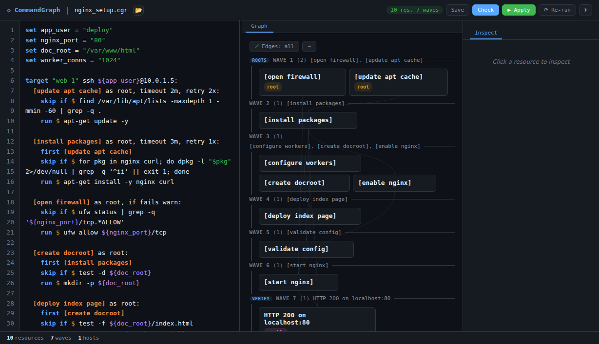
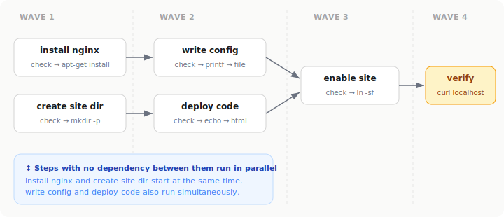
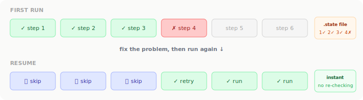
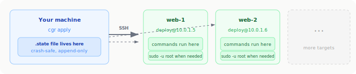
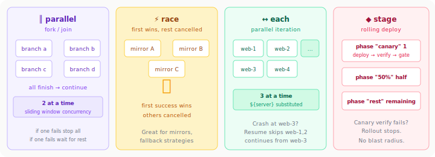

# CommandGraph

**Start describing what you want. Let CommandGraph chart the course.**

Write a plain-text file that reads like English (or use an agent on your behalf!). The engine builds a dependency graph, parallelizes what it can, and executes over SSH or locally.

One Python file with zero dependencies. No agents on your servers. No daemon. No database.

```python
--- Install nginx and basic app ---

target "web" ssh deploy@10.0.1.5:

  [install nginx] as root:
    skip if $ command -v nginx
    run    $ apt-get install -y nginx

  [write site config] as root:
    first [install nginx]
    content > /etc/nginx/sites-available/myapp:
      server {
          listen 80;
          server_name myapp.example.com;
          root /var/www/myapp;
          index index.html;
          location / { try_files $uri $uri/ =404; }
      }
    validate $ nginx -t

  [enable site] as root:
    first [write site config]
    skip if $ test -L /etc/nginx/sites-enabled/myapp
    run    $ ln -sf /etc/nginx/sites-available/myapp /etc/nginx/sites-enabled/myapp

  [deploy code]:
    first [install nginx]
    skip if $ test -f /var/www/myapp/index.html
    run    $ mkdir -p /var/www/myapp && echo "<h1>Hello World</h1>" > /var/www/myapp/index.html

  [start nginx] as root:
    first [enable site], [deploy code]
    skip if $ systemctl is-active nginx
    run    $ systemctl reload-or-restart nginx

  verify "site is live":
    first [start nginx]
    run $ curl -sf http://localhost/
    retry 3x wait 2s
```

That's a complete, runnable deployment. `[brackets]` name your steps. `first` declares what must happen before. `skip if` makes it idempotent. `content >` writes config files with automatic `validate` and rollback. `verify` is your smoke test.

You can also compose graphs and pause for external approval:

```python
set deploy_id = "abc123"

target "local" local:

  [deploy app] from ./deploy_app.cgr:
    version = "2.1.0"

  [wait for approval]:
    first [deploy app]
    wait for webhook "/approve/${deploy_id}"
    timeout 4h

  [resume rollout]:
    first [wait for approval]
    run $ echo approved
```

---

## CommandGraph fills the operational story gap

Hardware gets racked. Ansible configures it. But the workflow in between -- waiting for hosts to come up, running playbooks in the right order, verifying the result, gating the next step on a health check -- usually lives in runbooks, chat threads, and operator memory. That is the gap CommandGraph fills.

---

## Web IDE

`cgr serve FILE` launches a browser-based IDE with a live DAG visualization and execution panel. The left pane is an editor; the right pane shows the dependency graph updating in real time as you edit. Run `apply`, stream step output, inspect state and history, and view collected report data -- all from the browser.

<p align="center">
  
</p>

Point it at any `.cgr` file on your machine:

```bash
# opens http://localhost:8080 with live editing + graph
cgr serve mysetup.cgr
```

---

## Installation

```bash
# Copy one file. That's it.
curl -O https://raw.githubusercontent.com/commandgraph/cgr/main/cgr.py
chmod +x cgr.py
sudo mv cgr.py /usr/local/bin/cgr

# Or just run it directly
python3 cgr.py apply mysetup.cgr
```

No pip install. No virtualenv. No dependencies. Python 3.9+ only.

## Safe local demo for first-time users

If you want to see CommandGraph work before touching a server, use the container demo suite in [`testing/`](./testing). It runs entirely locally, uses local files and disposable stub services instead of real infrastructure, and gives a new user a fast way to watch the engine plan, execute, fail, resume, and detect drift.

```bash
# 1. Clone the repo and enter it
git clone <repository-url>
cd commandgraph

# 2. Run the local demos
cd testing
./run-demos.sh list    # see the 10 demos
./run-demos.sh 1       # quick first demo: plan -> apply -> idempotent re-run
./run-demos.sh 3       # crash recovery and resume
./run-demos.sh         # run the full suite
```

What this gives you:

- No SSH targets, cloud accounts, or real services required
- A disposable container image with `cgr`, example graphs, and the template repo preloaded
- Narrated demos for validation, execution, templates, crash recovery, parallelism, race, drift detection, HTTP/reporting, CLI tooling, and state isolation

If you want to explore interactively:

```bash
cd testing
./run-demos.sh shell
```

Inside that shell, `cgr` is already on `PATH`, examples live in `/opt/cgr/examples`, and the repo is at `/opt/cgr/repo`.

---

## The case for CommandGraph

Most teams don't struggle because they lack tools. They struggle because the workflow *across* those tools is brittle.

Some of these symptoms may sound familiar:

- Hardware is racked, but the handoff to Ansible lives in a runbook nobody reads until something breaks
- One failed health check means rerunning broad chunks of work — no trustworthy resume point
- Canary logic is implied by convention, not encoded in the workflow
- Operators must remember which steps are safe to retry and which are not
- Incident reviews have logs, but not a clean execution graph or machine-readable run record

CommandGraph turns that glue layer into something explicit, resumable, and inspectable. It is not a replacement for Ansible — it is the orchestration layer around it.

### Running Ansible playbooks from CommandGraph

Already have Ansible playbooks? Run them as steps inside a CommandGraph. The graph picks up right after hardware is racked -- waiting for hosts to respond, running playbooks in order, verifying the result -- with crash recovery, dependency ordering, and parallel execution that Ansible alone can't express:

```python
--- Configure freshly racked servers with Ansible ---

set env = "staging"

target "control" local:

  [wait for hosts reachable]:
    run    $ ansible -i inventory/${env} all -m ping
    retry 10x wait 30s

  [run base playbook]:
    first [wait for hosts reachable]
    run    $ ansible-playbook -i inventory/${env} playbooks/base.yml
    timeout 15m, retry 1x wait 30s

  [run app playbook]:
    first [run base playbook]
    run    $ ansible-playbook -i inventory/${env} playbooks/app.yml --tags deploy
    timeout 10m

  [smoke test]:
    first [run app playbook]
    get "https://${env}.example.com/health"
    expect 200
    retry 5x wait 10s

  verify "fleet is healthy":
    first [smoke test]
    run $ ansible -i inventory/${env} all -m shell -a 'systemctl is-active myapp'
```

The hardware team racks the servers. CommandGraph picks up from there -- waiting, configuring, verifying -- so the handoff is encoded in the graph rather than a chat message. You can also use Ansible inventory files directly with `inventory "hosts.ini"` (see [Ansible inventory compatibility](#ansible-inventory-compatibility)).

For a complete end-to-end production example -- canary rollout, API registration, and human approval gate in a single graph -- see [Cookbook Recipe 11: Full Production Rollout](COOKBOOK.md#recipe-11-full-production-rollout).

---

## What the engine does for you

The engine reads your file, builds a dependency graph, and groups independent steps into parallel waves:

<p align="center">
  
</p>

Steps with no dependency between them run in the same wave simultaneously. Steps that depend on others wait for their prerequisites. You didn't have to think about this -- the engine figured it out from your `first` declarations.

---

## Crash recovery that actually works

Every completed step is written to a `.state` file atomically. Crash mid-run, fix the problem, run again. Completed steps skip from state without even SSHing to the server.

Unlike rerunning an entire pipeline and hoping earlier steps are harmless, CommandGraph knows exactly what succeeded. Fix the problem and rerun -- the engine continues from the failed point, not from the top.

Need isolated journals for concurrent parameterized runs? Use `cgr apply FILE --run-id canary` to salt the default state path, or `cgr apply FILE --state /path/to/run.state` to pin an explicit journal.

<p align="center">
  
</p>

When a step fails, the engine automatically shows the command and stderr. No re-running with `-v` to figure out what went wrong.

---

## Built-in reporting

CommandGraph ships with two reporting layers. You can collect stdout from specific steps for audit-style output, and you can also ask `apply` to write a machine-readable run summary for CI or archival.

Mark any step with `collect "key"` and its stdout is saved after execution:

```python
--- Audit a host ---

target "web-1" ssh ops@10.0.1.5:

  [hostname]:
    run $ hostname
    collect "hostname"

  [kernel]:
    run $ uname -r
    collect "kernel"

  [disk]:
    run $ df -h /
    collect "disk_usage"
```

After `cgr apply audit.cgr`, view or export the collected data:

```bash
cgr report audit.cgr
cgr report audit.cgr --format json
cgr report audit.cgr --format csv -o audit.csv
cgr report audit.cgr --keys hostname,kernel
```

For multi-node graphs, `cgr report` turns collected keys into columns, which makes fleet audits and inventory snapshots easy to export.

If you want a run-level execution summary instead, `cgr apply FILE --report run.json` writes JSON containing wall-clock timing, per-step statuses, provenance, dedup information, and any collected outputs.

If you want the entire `apply` command itself to be machine-readable, use:

```bash
cgr apply deploy.cgr --output json
```

That prints the execution result to stdout as JSON, including per-step results plus wave and run timing pulled from the state journal.

## Wait gates and metrics

Two lightweight coordination primitives are now built in:

```python
[wait for file]:
  wait for file "./ready.flag"
  timeout 30m

[wait for approval]:
  wait for webhook "/approve/${deploy_id}"
  timeout 4h
```

`wait for file` polls for file existence locally or over SSH. `wait for webhook` starts a small local HTTP listener during `apply`; a `GET` or `POST` to the configured path releases the step.

Execution timing is also tracked automatically. The state journal now stores:

- Wall-clock time per step
- Wall-clock time per wave
- Total wall-clock time for the latest run
- The latest bottleneck step and its duration

That means runs can answer questions like "how long did this deploy take?" without any external metrics system.

---

## SSH execution

Point a target at an SSH host and every command runs remotely. State stays on your machine. No agent or runtime needed on the server -- just SSH access.

<p align="center">
  
</p>

There is no agent to distribute, no daemon to babysit, and no extra control plane to keep alive. For organizations cautious about adding resident components to hosts, this matters.

Multiple targets in one file run in parallel. Steps with `as root` are automatically wrapped in `sudo` on the remote side.

---

## Parallel constructs

Four constructs for explicit concurrency, all composable with everything else:

<p align="center">
  
</p>

### `parallel` -- fork/join with bounded concurrency

```python
[build everything]:
  parallel 2 at a time:
    [compile frontend]: run $ npm run build
    [compile backend]:  run $ cargo build --release
    [build docs]:       run $ mkdocs build
```

### `race` -- first to succeed wins, rest cancelled

```python
[download package]:
  race into pkg.tar.gz:
    [us mirror]:  run $ curl -sf https://us.example.com/pkg.tar.gz -o ${_race_out}
    [eu mirror]:  run $ curl -sf https://eu.example.com/pkg.tar.gz -o ${_race_out}
```

Each branch writes to its own temp file. The winner is atomically renamed. No clobbering.

### `each` -- parallel iteration over a list

```python
set servers = "web-1,web-2,web-3,web-4"

[deploy to fleet]:
  each server in ${servers}, 3 at a time:
    [deploy to ${server}]:
      run $ ssh ${server} '/opt/activate.sh'
```

### `stage`/`phase` -- canary rollouts with verification gates

```python
[rolling deploy]:
  stage "production":
    phase "canary" 1 from ${servers}:
      [deploy ${server}]: run $ activate.sh
      verify "healthy": run $ curl -sf http://${server}/health
        retry 10x wait 3s

    phase "rest" remaining from ${servers}:
      each server, 4 at a time:
        [deploy ${server}]: run $ activate.sh
```

The canary deploys to 1 server. Its verify must pass before the rest begin. If unhealthy, the rollout stops.

---

## File management without shell gymnastics

Write configs, edit lines, manage INI/JSON files -- all with built-in validation:

```python
[write nginx config]:
  content > /etc/nginx/sites-available/myapp:
    server {
        listen 80;
        server_name example.com;
    }
  validate $ nginx -t

[harden sshd]:
  line "PermitRootLogin no" in /etc/ssh/sshd_config, replacing "^#?PermitRootLogin"
  line "PasswordAuthentication no" in /etc/ssh/sshd_config, replacing "^#?PasswordAuthentication"
  validate $ sshd -t

[tune postgres]:
  ini /etc/postgresql/14/main/postgresql.conf:
    shared_buffers = "256MB"
    max_connections = "200"
```

Writes are atomic. `validate` runs after the write; if it fails, the file is reverted.
Inline `content >` and `block in` bodies preserve literal `#` characters, so config comments stay intact.

---

## HTTP as a first-class operation

Call APIs directly -- no curl piping, no shell escaping:

```python
[register host]:
  post "${api_host}/hosts"
  auth bearer "${api_token}"
  body json '{"hostname": "web-1", "status": "active"}'
  expect 200..299
  collect "registration"
```

Supports `get`, `post`, `put`, `patch`, `delete`. Auth tokens are automatically redacted from output. On SSH targets, requests execute via `curl`.

---

## Reusable templates

44 standard templates across 21 categories -- packages, containers, TLS, firewalls, databases, monitoring, backups, and more. Here's a production-grade nginx + certbot deployment that uses five of them:

```python
--- Full-stack Nginx + TLS deployment ---

using apt/install_package, firewall/allow_port, systemd/enable_service, tls/certbot, nginx/vhost

set domain   = "app.example.com"
set ssh_user = "deploy"
set ssh_host = "10.0.1.5"

target "web-1" ssh ${ssh_user}@${ssh_host}:

  [install web packages] from apt/install_package:
    name = "nginx curl"

  [open http] from firewall/allow_port:
    port = "80"

  [open https] from firewall/allow_port:
    port = "443"

  [get tls cert] from tls/certbot:
    domain = "${domain}"
    email  = "ops@example.com"

  [configure vhost] from nginx/vhost:
    domain   = "${domain}"
    port     = "443"
    doc_root = "/var/www/${domain}"

  [deploy app files] as root:
    first [install web packages], [configure vhost]
    skip if $ test -f /var/www/${domain}/index.html
    run    $ echo '<h1>${domain} is live</h1>' > /var/www/${domain}/index.html

  [start nginx] as root, if fails stop:
    first [deploy app files], [get tls cert], [open https], [open http]

    [write ssl params] as root:
      skip if $ test -f /etc/nginx/snippets/ssl-params.conf
      content > /etc/nginx/snippets/ssl-params.conf:
        ssl_protocols TLSv1.2 TLSv1.3;
        ssl_prefer_server_ciphers on;
        ssl_ciphers HIGH:!aNULL:!MD5;
      validate $ nginx -t

    first [write ssl params]
    skip if $ systemctl is-active nginx | grep -q active
    run    $ systemctl reload-or-restart nginx

  [enable on boot] from systemd/enable_service:
    service = "nginx"

  verify "HTTPS 200 on ${domain}":
    first [start nginx], [enable on boot]
    run   $ curl -sfk -o /dev/null -w '%{http_code}' https://${domain}/ | grep -q 200
    retry 3x wait 2s
```

Templates are `.cgr` files in the `repo/` directory. Each one declares its parameters, version, and description. Write your own by dropping a file in the right category. No Galaxy. No collections. Just files.

Categories include: `apt`, `dnf`, `nginx`, `tls`, `firewall`, `systemd`, `service`, `docker`, `k8s`, `user`, `ssh`, `security`, `file`, `backup`, `db`, `monitoring`, `webhook`, `cron`, and `pkg`.

---

## Cross-distro, conditionals, and runtime detection

```python
[install packages (apt)]:
  when os_family == "debian"
  run $ apt-get install -y nginx

[install packages (yum)]:
  when os_family == "redhat"
  run $ yum install -y nginx
```

```python
[detect pigz]:
  run $ command -v pigz
  on success: set compressor = "pigz"
  on failure: set compressor = "gzip"
  if fails ignore

[compress]:
  first [detect pigz]
  run $ ${compressor} archive.tar
```

Override anything at runtime: `cgr apply --set os_family=redhat --set version=2.5.0`

---

## Encrypted secrets

```bash
cgr secrets create vault.enc        # create encrypted vault
cgr secrets edit vault.enc          # edit in $EDITOR
```

```python
secrets "vault.enc"

target "db" ssh deploy@10.0.2.3:
  [configure db]:
    run $ echo "${db_password}" | psql -c "ALTER USER app PASSWORD '$(cat)'"
```

Secrets are decrypted at runtime, never written to disk, and auto-redacted from all output.

---

## Ansible inventory compatibility

Already have inventory files? Use them directly:

```python
inventory "hosts.ini"

each name, addr in ${webservers}:
  target "${name}" ssh ${addr}:
    [deploy to ${name}]:
      run $ /opt/deploy.sh ${version}
```

---

## Where CommandGraph fits best

CommandGraph is especially well-suited for:

- staged application deploys across fleets with canary verification
- maintenance workflows that sequence SSH, Ansible, API calls, and approval gates
- operational runbooks that currently live as a mix of CI config and tribal knowledge
- audits and inventory collection across many hosts
- recovery-prone processes where restarting from scratch is expensive
- any workflow that benefits from "run this in parallel, verify, then continue"

## Getting started in your organization

Don't start with a platform migration. Start with one painful workflow:

- a release process that needs canary promotion and human approval gates
- a node maintenance runbook you're tired of executing step by step
- a provisioning-plus-configure-plus-verify sequence that spans three tools today
- a fleet audit that currently requires too many moving parts

Use CommandGraph as the orchestration layer around the tools you already have. That is where it becomes persuasive quickly.

For a complete end-to-end reference -- Ansible, canary rollout, API registration, and approval gate in a single graph -- see [Cookbook Recipe 11: Full Production Rollout](COOKBOOK.md#recipe-11-full-production-rollout).

---

## CLI reference

| Command | What it does |
|---------|-------------|
| `cgr plan FILE` | Show execution order and parallel waves |
| `cgr apply FILE` | Execute the graph (`--dry-run`, `--parallel N`, `--tags`, `--run-id`, `--state`) |
| `cgr validate FILE` | Check syntax and dependencies |
| `cgr check FILE` | Run checks to detect drift |
| `cgr visualize FILE` | Generate interactive HTML DAG visualization |
| `cgr serve FILE` | Web IDE with live graph and execution |
| `cgr explain FILE STEP` | Show the dependency chain for a step |
| `cgr why FILE STEP` | Show what depends on a step |
| `cgr state show FILE` | Show done/failed/pending state |
| `cgr state test FILE` | Re-run checks, detect drift |
| `cgr state reset FILE` | Wipe state, start fresh |
| `cgr diff FILE FILE2` | Structural graph comparison |
| `cgr ping FILE` | Verify SSH connectivity to all targets |
| `cgr report FILE` | View collected outputs (table, JSON, CSV) |
| `cgr lint FILE` | Best-practice linter |
| `cgr fmt FILE` | Auto-formatter |
| `cgr convert FILE` | Convert between `.cg` and `.cgr` formats |
| `cgr secrets CMD FILE` | Manage encrypted secrets |
| `cgr init` | Scaffold a new `.cgr` file |
| `cgr doctor` | Check environment for common issues |

---

## Drift detection

```bash
# State says config is deployed. Someone deleted it on the server.
cgr state test deploy.cgr

  write_config: DRIFTED -- check now fails (was: success)

# Fix it:
cgr apply deploy.cgr   # only the drifted step re-runs
```

---

## Design principles

**Files are the interface.** A `.cgr` file is a complete, portable, version-controllable description of your infrastructure. No web UI required, no database, no daemon.

**Idempotent by default.** Every step has a `skip if` check. Run it 10 times, get the same result.

**Crash-safe.** State is append-only with `fsync` after each write. A power failure loses at most one line.

**Zero dependencies.** One Python file, stdlib only. Copy it to an air-gapped server and it works.

**Human-readable.** The syntax reads like English: "First install nginx. Skip if already installed. Run apt-get install." No YAML indentation wars. No JSON escaping. No Jinja2 templating bugs.

**Graphs, not lists.** You declare dependencies. The engine computes execution order and maximizes parallelism. Reorder your file however you want -- the result is the same.

---

## Testing

```bash
python3 -m py_compile cgr.py                   # syntax check
python3 -m pytest test_commandgraph.py -q      # test suite
cd testing/ && ./run-demos.sh                  # 10 local container demos
cd testing-ssh/ && ./run-ssh-demos.sh          # 5 SSH demos
```

---

## Documentation

| Document | For whom | What's in it |
|----------|----------|-------------|
| [QUICKSTART.md](QUICKSTART.md) | New users | Zero to running in 5 minutes |
| [TUTORIAL.md](TUTORIAL.md) | Beginners | 9 guided lessons, ~1 hour |
| [COOKBOOK.md](COOKBOOK.md) | Operators | 11 real-world recipes, including a full production rollout |
| [MANUAL.md](MANUAL.md) | Reference | Complete syntax for `.cgr` and `.cg` |
| [COMMANDGRAPH_SPEC.md](COMMANDGRAPH_SPEC.md) | Code generators | Formal PEG grammar |
| [AGENTS.md](AGENTS.md) | Contributors | Architecture, internals, and build workflow |

---

### Maintainer note

The release artifact is a single `cgr.py`. Development happens in `cgr_src/`, with `cgr_dev.py` as the thin dev entrypoint. Rebuild after changing source modules, `ide.html`, or `visualize_template.py`:

```bash
python3 cgr_dev.py apply build.cgr
```

See [AGENTS.md](AGENTS.md) for the full build workflow and [MODULE_MAP.md](MODULE_MAP.md) for the quick reference on where parser, resolver, executor, state, IDE, and CLI changes live.

---
